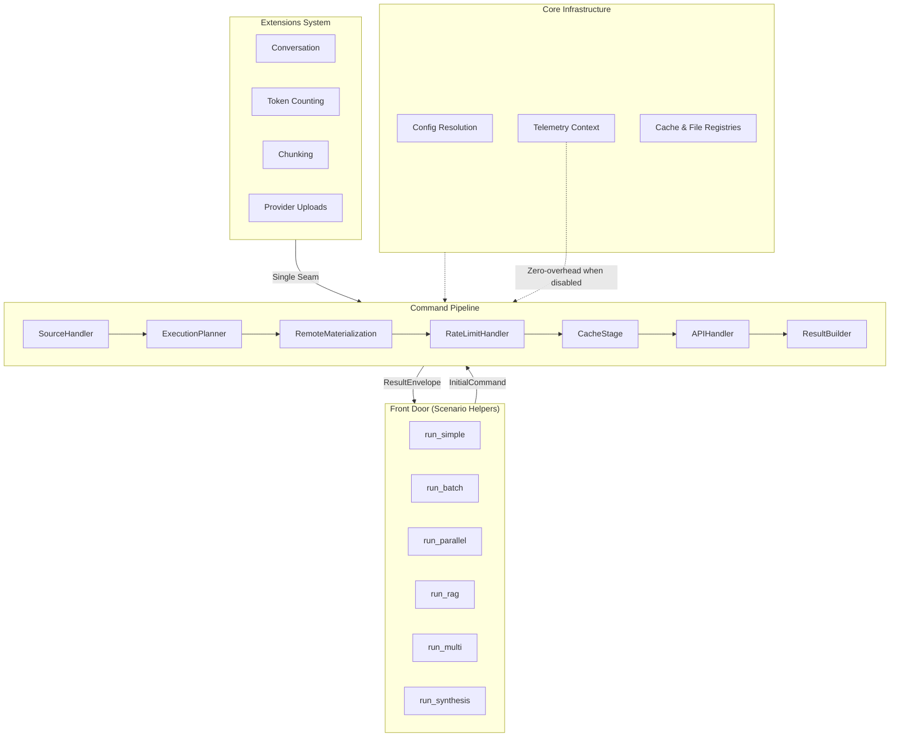

## Summary

The Gemini Batch Prediction Framework is my Google Summer of Code 2025 project with Google DeepMind. Over three months, I designed and built a production-ready Python framework for efficient multimodal analysis on Google's Gemini API. The system achieves **4–5x fewer API calls** and **up to 75% cost reduction** through intelligent request batching and context caching - validated through direct experimentation across real workloads.

This is the most complex system I've built to date: ~15,500 lines of source code, ~18,300 lines of tests (95%+ coverage), 104 documentation pages, and 33 runnable cookbook recipes. The framework supports text, PDFs, images, videos, and YouTube URLs through a unified async pipeline with opt-in telemetry, a modular extensions system, and dedicated research utilities for reproducible benchmarking.

## Motivation

Large language model APIs present a fundamental tension: powerful capabilities constrained by rate limits, costs, and latency. When processing multiple documents or asking multiple questions about shared content, naive approaches - one API call per query - waste tokens re-encoding identical context and burn through rate limits unnecessarily.

The challenges compound for multimodal workloads:

- **Token economics**: Re-processing shared context (a PDF, video, or image set) across queries multiplies costs linearly
- **Rate constraints**: API tiers impose requests-per-minute limits that naive fan-out quickly exhausts
- **Reliability**: Network failures, partial responses, and provider quirks require robust handling
- **Observability**: Production systems need metrics, but instrumentation overhead must be negligible when disabled

The Gemini Batch Prediction Framework addresses these challenges through a principled architecture: a command pipeline that separates concerns cleanly, intelligent planning that batches related work, and caching strategies that amortize context costs across queries.

## System Architecture



The architecture follows a **command pipeline** pattern with type-erased async handlers. Each stage transforms an immutable command object, and the executor enforces a terminal invariant: the final output must be a valid `ResultEnvelope`. This design provides several guarantees:

1. **Separation of concerns**: Source preparation, execution planning, rate limiting, caching, API calls, and result building are isolated stages
2. **Testability**: Each handler can be tested in isolation; the pipeline can be composed with mock handlers
3. **Extensibility**: New stages slot into the chain without modifying existing handlers
4. **Observability**: Stage durations are captured automatically and surfaced in result metrics

## The "Pit of Success" API

A key design goal was making correct usage effortless. The front door module provides scenario-named helpers that guide users toward efficient patterns:

```python
import asyncio
from gemini_batch import run_simple, run_batch, types

async def main():
    # Single query on a single source
    result = await run_simple(
        "What are the key findings?",
        source=types.Source.from_file("research_paper.pdf"),
    )
    print(result["answers"][0])

    # Multiple questions over shared context (vectorized)
    questions = [
        "Summarize the methodology",
        "List the main conclusions",
        "What are the limitations?",
    ]
    sources = types.sources_from_directory("papers/")
    
    envelope = await run_batch(questions, sources=sources)
    for i, answer in enumerate(envelope["answers"], 1):
        print(f"Q{i}: {answer}")

asyncio.run(main())
```

The helpers abstract away complexity while preserving escape hatches. Users who need fine-grained control can construct `InitialCommand` objects directly and call the executor, but most workflows map cleanly onto the provided helpers.

## Telemetry: Zero Overhead When You Don't Need It

Production systems need observability, but instrumentation can't impose costs on users who don't need it. The telemetry system uses a **conditional singleton** pattern:

```python
# Evaluated once at import time
_TELEMETRY_ENABLED = os.getenv("GEMINI_BATCH_TELEMETRY") == "1"

def TelemetryContext(*reporters):
    if _TELEMETRY_ENABLED:
        return _EnabledTelemetryContext(*reporters)
    return _NO_OP_SINGLETON  # Immutable, stateless, free
```

When disabled, every telemetry call returns a pre-allocated no-op object. No allocations, no dictionary lookups, no overhead. When enabled, the system captures hierarchical timing with `ContextVar` for async safety, allowing nested scopes across concurrent operations:

```python
with ctx("pipeline.stage", stage="api_handler"):
    with ctx("api.request", model="gemini-2.0-flash"):
        # Timing captured with full scope path
        response = await make_request()
    ctx.metric("tokens.used", response.usage.total_tokens)
```

The built-in reporter generates hierarchical reports; users can inject custom reporters (e.g., for Prometheus, OpenTelemetry) via the duck-typed protocol.

## Extensions: Composability Without Contamination

Extensions demonstrate how to build powerful features without modifying the core. They consume only public types and the single executor seam:

**Conversation Extension** (Stable): Multi-turn sessions with immutable state snapshots:

```python
from gemini_batch import create_executor
from gemini_batch.extensions import Conversation, PromptSet

executor = create_executor()
conv = Conversation.start(executor, sources=[document])

# Simple chaining
conv = await conv.ask("Summarize the introduction")
conv = await conv.ask("What methodology was used?")

# Vectorized batch (one turn, multiple answers)
conv, answers, metrics = await conv.run(
    PromptSet.vectorized("Key findings?", "Limitations?", "Future work?")
)
```

Every operation returns a new `Conversation` object: the original is never mutated. This enables safe concurrent use, trivial undo (keep the old reference), and audit trails via the `ConversationEngine` and `ConversationStore` backends.

**Token Counting Extension** (Stable): Uses the actual Gemini tokenizer for accurate estimates before execution, enabling cost prediction and context window management.

**Chunking Extension** (Experimental): Splits long documents by approximate token budgets, enabling processing of content that exceeds context limits.

## Research Utilities: Bridging Engineering and Science

The `research` module provides helpers for reproducible benchmarking, essential for evaluating optimization strategies:

```python
from gemini_batch import research, types

report = await research.compare_efficiency(
    prompts=["Summarize", "List key points", "Identify themes"],
    sources=types.sources_from_directory("corpus/"),
    trials=3,
    include_pipeline_durations=True,
)

print(report.summary())
# tokens x4.2 (saved 3,847), time x3.1 (saved 12.4s), calls x3.0 (saved 6)

data = report.to_dict()  # Environment capture for reproducibility
```

The efficiency comparison runs the same workload through both the vectorized pipeline and a naive per-prompt baseline, computing ratios for tokens, time, and API calls. Environment metadata (Python version, platform, git SHA if available) is captured automatically to aid cross-machine comparisons.

## Experimental Validation

The framework's efficiency claims are grounded in direct experimentation. Across varied workloads - academic papers, video transcripts, mixed-media corpora - the vectorized pipeline consistently outperforms naive approaches:

| Metric | Improvement | Mechanism |
|--------|-------------|-----------|
| API Calls | 3–5x fewer | Request batching, vectorized prompts |
| Token Usage | 2–4x reduction | Context caching, shared preparation |
| Latency | 2–3x faster | Parallel uploads, cached context reuse |
| Cost | Up to 75% savings | Combined token and call reduction |

These figures represent typical results across multiple trials. Actual improvements depend on workload characteristics: larger shared contexts and more prompts per context yield greater benefits.

## Engineering Discipline

Building a production-grade framework requires more than functional code:

- **Type Safety**: Python 3.13 with strict MyPy configuration. Generic handlers use type erasure to support the pipeline's heterogeneous stages while preserving type checking at boundaries.

- **Testing Strategy**: Contract tests verify architectural invariants. Unit tests cover components in isolation. Integration tests exercise cross-component flows. Characterization tests capture golden outputs for regression detection. The test suite runs in CI on every push.

- **Documentation**: 104 Markdown pages following the Diátaxis framework (tutorials, how-to guides, explanations, reference). API documentation is generated from docstrings via mkdocstrings.

- **Developer Experience**: A CLI (`gb-config doctor`) validates environment setup. Deterministic mock mode enables testing without API keys. Pre-commit hooks enforce formatting and linting.

## What I Learned

This project pushed me to grow in several dimensions:

**Systems thinking**: Designing a pipeline that separates concerns cleanly while maintaining performance required understanding how abstractions compose and where they leak.

**API design**: The tension between power and simplicity - providing escape hatches for advanced users without overwhelming newcomers - shaped every public interface.

**Production mindset**: Features like zero-overhead telemetry, graceful degradation, and environment-aware configuration aren't glamorous, but they're what distinguish tools people actually use from toys.

**Documentation as product**: Writing 104 pages of docs taught me that explaining a system clearly often reveals design flaws. Several architectural decisions improved because I couldn't explain them well.

## Limitations and Future Directions

The framework has clear boundaries:

- **Single provider**: Currently supports only Google's Gemini API. The adapter abstraction exists for extension, but only one implementation is complete.
- **Async-only**: The pipeline is fully async. Sync wrappers exist for convenience, but the architecture assumes async execution.
- **Pre-1.0**: Research utilities and some extensions are experimental; APIs may evolve based on feedback.

Promising directions for future work:

1. **Multi-provider support**: Implement adapters for OpenAI, Anthropic, and open-source models to enable provider-agnostic workflows
2. **Streaming responses**: Support token-by-token streaming for interactive applications
3. **Distributed execution**: Extend the pipeline for multi-node batch processing
4. **Semantic caching**: Cache at the semantic level (similar queries) rather than exact match

## Conclusion

The Gemini Batch Prediction Framework demonstrates that thoughtful architecture can yield significant practical benefits. By separating concerns in the command pipeline, providing scenario-first helpers, implementing zero-overhead telemetry, and designing extensions that compose without contaminating the core, the system achieves 4–5x efficiency improvements while remaining approachable for new users.

This project represents three months of intensive work - design, implementation, testing, documentation - executed solo as part of Google Summer of Code 2025 with Google DeepMind. I'm grateful for the guidance and support I received throughout the program.

The project is open source and available on [GitHub](https://github.com/seanbrar/gemini-batch-prediction). The [documentation site](https://seanbrar.github.io/gemini-batch-prediction/) includes tutorials, API reference, and runnable cookbook recipes.
